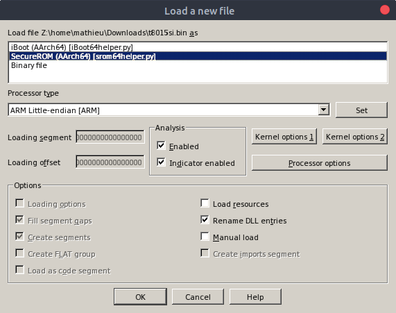

# srom64helper
IDA loader for Apple's SecureROM

### Installation

Copy `srom64helper.py` to the `loaders` folder in IDA directory.

### Credits
srom64helper is based on [argp](https://twitter.com/_argp)'s [iBoot64helper](https://github.com/argp/iBoot64helper)
